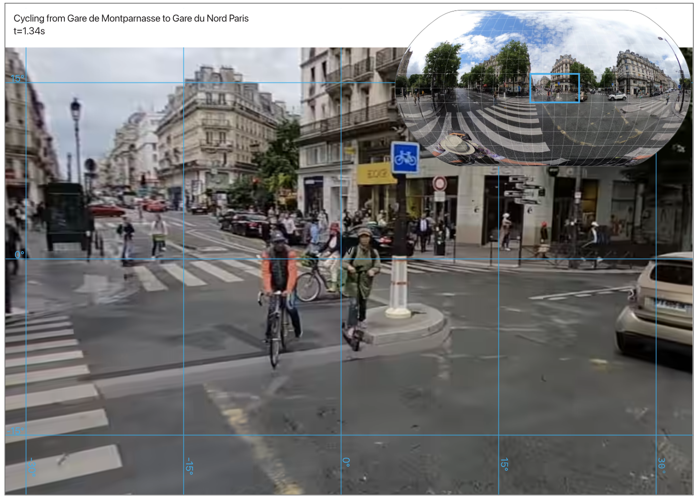
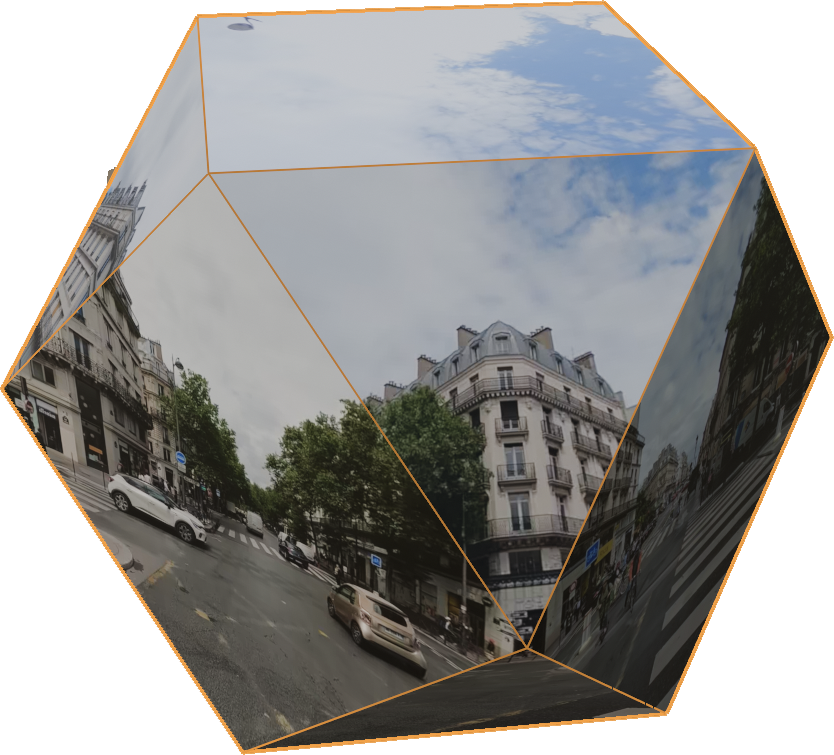

# Tangible 360° Video Artifact Toolkit

This is the code for a website that helps create designers (and everyone else) create `tangible 360° video artifacts`. In order to share and collaborate on 360° video projects, we need a way to create tangible artifacts that represent the 360° video experience.

## What is a tangible 360° video artifact?

The core of a tangible 360° video artifact is a physical object that represents a single frame from 360° video, in this case we have two types of tangible artifacts:
1. flat artifacts: a 2D representation of a frame of 360° video, with a specific focus and a minimap for overview.

2. sphere-ish artifacts: a 3D representation of a frame of 360° video using a cut and fold pattern of a sphere-ish object.

### I want to know more

read the research paper here (todo: add link to research paper)

## Features:
- [] Provide guidelines for selecting a type of artifact
- [] Create a flat artifact
- [X] Create a sphere-ish artifact
- [X] Download the artifact as a PDF
- [] Provide a bunch of different artifacts
- [] Support the creation of a bunch of different conventions